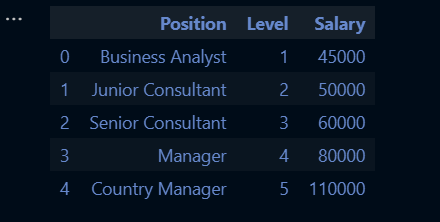
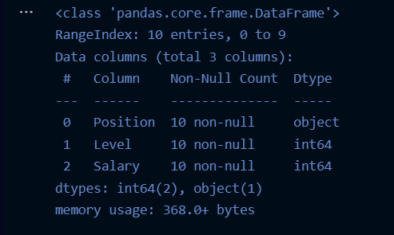
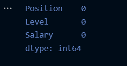
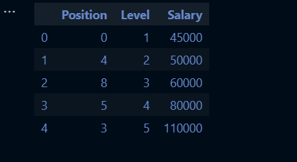
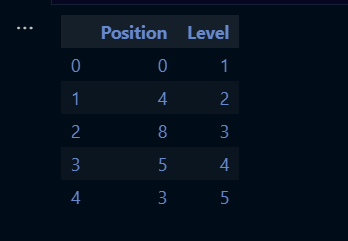

# Implementation-of-Decision-Tree-Regressor-Model-for-Predicting-the-Salary-of-the-Employee...

## AIM:
To write a program to implement the Decision Tree Regressor Model for Predicting the Salary of the Employee.

## EQUIPMENTS REQUIRED:
1. Hardware – PCs.
2. Anaconda – Python 3.7 Installation / Moodle-Code Runner.

## ALGORITHM:
### Step 1:
Import the standard libraries from python.

### Step 2:
Upload the dataset and check for any null values using .isnull() function.

### Step 3:
Import LabelEncoder and encode the dataset.

### Step 4:
Import DecisionTreeRegressor from sklearn and apply to the model from the dataset.

### Step 5:
Predict the values of the arrays.

### Step 6:
Import metrics from sklearn and calculate the MSE and R2 of the model from the dataset.

### Step 7:
Predict the values of array.

### Step 8:
Apply it to the new unknown values.

### Step 9:
End the program.

## PROGRAM:
```
/*
Program to implement the Decision Tree Regressor Model for Predicting the Salary of the Employee.
Developed by: Anto Richard.S 
RegisterNumber: 212221240005  
*/

import pandas as pd
data = pd.read_csv("Salary.csv")

data.head()

data.info()

data.isnull().sum()

from sklearn.preprocessing import LabelEncoder
le = LabelEncoder()
data["Position"] = le.fit_transform(data["Position"])
data.head()

x = data[["Position","Level"]]
x.head()

y = data["Salary"]

from sklearn.model_selection import train_test_split
x_train,x_test,y_train,y_test = train_test_split(x,y,test_size = 0.2,random_state = 2)

from sklearn.tree import DecisionTreeRegressor
dt = DecisionTreeRegressor()

dt.fit(x_train,y_train)
y_pred = dt.predict(x_test)

from sklearn import metrics
mse = metrics.mean_squared_error(y_test,y_pred)
mse

r2 = metrics.r2_score(y_test,y_pred)
r2

dt.predict([[5,6]])

```

## OUTPUT:

### DATA.HEAD():


### DATA.INFO():


### DATA.ISNULL().SUM():


### DATA.HEAD() USING LABEL ENCODER:


### X.HEAD():


### MEAN SQUARE ERROR:


### R2:


### DATA PREDICTION:


## RESULT:
Thus the program to implement the Decision Tree Regressor Model for Predicting the Salary of the Employee is written and verified using python programming.
